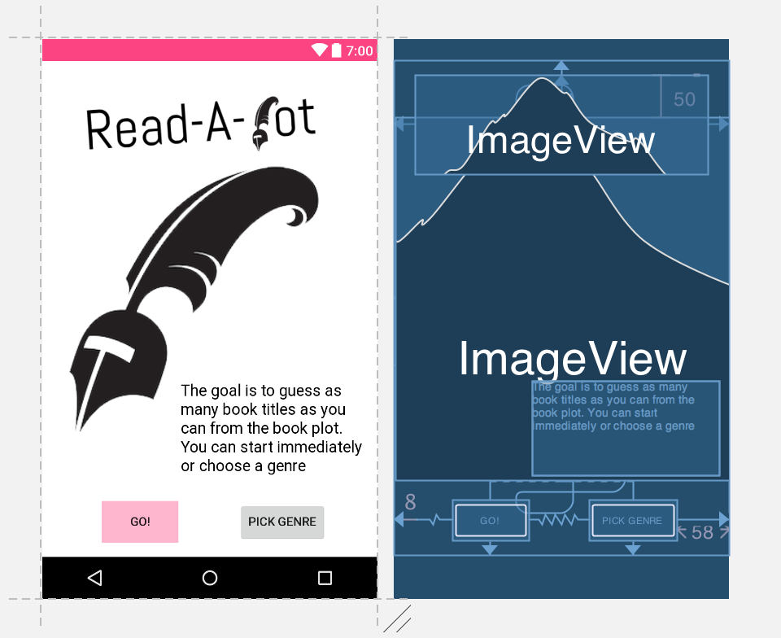

Let's guess the book title!  

Julia Anten 
Programmeerproject 
Minor Programmeren UvA
## Design Document

The document below explains the different classes and formulas, that will be used in the app. 

###Functions
1. Explains and sends user to the game
	- goToGame
2. Lets users play the game
	- bookSearch --> needs 3
		requests 3 book from same genre
	- placeBooks --> needs 5
		assigns values to answers and sets them to their views.
	- onAnswerClicked
		cheks which answer button is clicked
	- checkAnswer
		adds 1 to streak if correct, else streak back to zero
	- changeButtons
		changes color of answer buttons (red and green) and makes next button visible
	- onNextClicked
		calls booksearch again, takes care of new question
	- checkHighScore
		if wrong answer, check is streak was longer than current high scores and change high scores if so
3. Sends request to 4 and filters the search results
	- filterAndRetrieve
		makes sure only "popular" books are retrieved
4. Actually requests books from API
5. Model class for answers. An answer exists of a string and a number which states is it's the correct answer.
Trophee. Shows 3 highest scores
	- onCreateOptionsMenu
		creates high score button
	- onOptionsSelected
		shows 3 highest scores in menu

I will use the Google Books API to get information about... books (surprise). 
<https://developers.google.com/books/>

###Screenshots from app design

    
Logo from [rbmm](http://rbmm.com/work/galahad-books-logo/)
