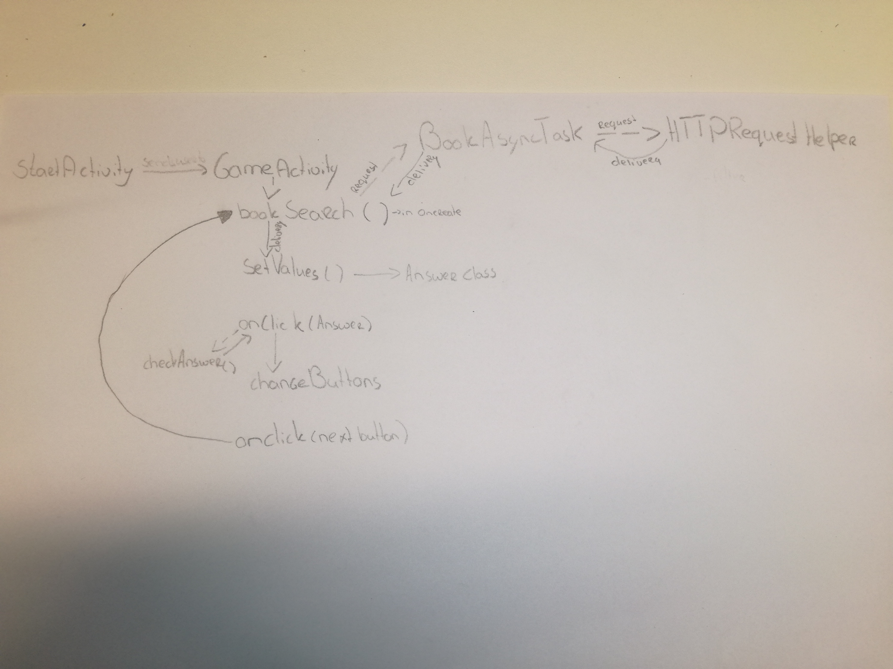

# Process Book

# Day 1 - 6 june
- Drew initial sketches of the design
- Created README.md

# Day 2 - 7 june
- Created the android studio project
- Made sketches for app flow and needed functions

# Day 3 - 8 june
- Completed the prototype
- Completed DESIGN.md and the diagram

# Day 4 - 9 june
- Presented my ideas
- Added ideas from presentations to README.md
 

## Week 2
# Day 5 - 12 june
- Made planning for rest of the week
- Edited the design in android studio and DESING.md 
- Google books API can't request random books, so I will add a file with approx. 100 best sold book titles from [goodreads](http://www.goodreads.com/list/show/33934.Best_Selling_Books_of_All_Time).

# Day 6 - 13 june
- In some descriptions, the name of the book is written. It would be cool to deletes this from the description.
- Made the httprequesthelper and the asynctask. They recieve JSON data, but it's not handeled right.

# Day 7 - 14 june
