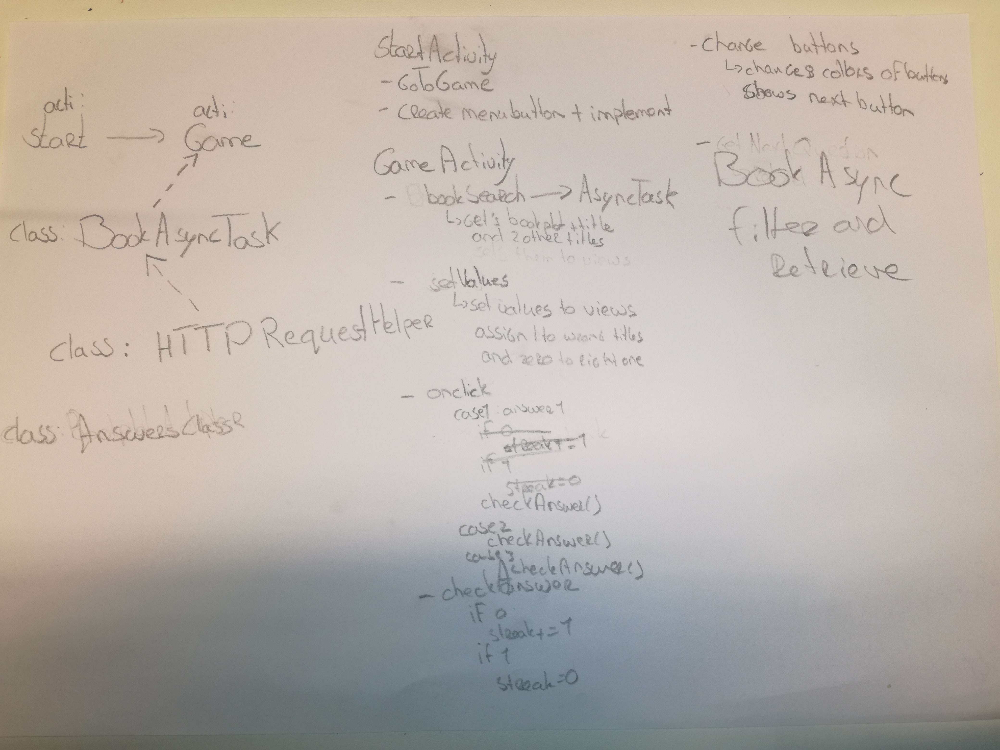
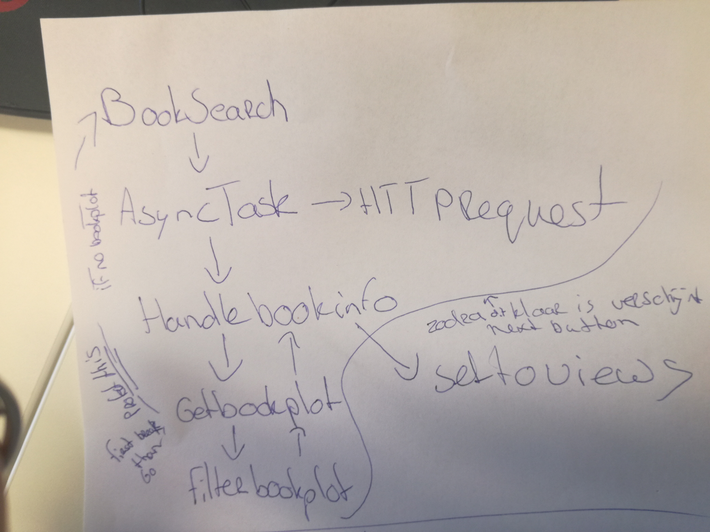

# Process Book

# Day 1 - 6 June
- Drew initial sketches of the design
- Created README.md

# Day 2 - 7 June
- Created the android studio project
- Made sketches for app flow and needed functions

# Day 3 - 8 June
- Completed the prototype
- Completed DESIGN.md and the diagram

# Day 4 - 9 June
- Presented my ideas
- Added ideas from presentations to README.md
 

## Week 2
# Day 5 - 12 June
- Made planning for rest of the week
- Edited the design in android studio and DESING.md 
- Google books API can't request random books, so I will add a file with approx. 100 best sold book titles from [Goodreads](http://www.goodreads.com/list/show/33934.Best_Selling_Books_of_All_Time).

# Day 6 - 13 June
- In some descriptions, the name of the book is written. It would be cool to deletes this from the description.
- Made the httprequesthelper and the asynctask. They receive JSON data, but it's not handled right.

# Day 7 - 14 June
- Answer class isn't necessary. 
- Plot and answers get set in their views.
- Answers get different color after answer is chosen.
- basic app functionality works, but the descriptions need a closer look.

# Day 8 - 15 June
### General ideas
TODO:

- Make responses from API better
	- Make sure he always gets the right book
	- Make sure he always finds something
- Erase some information from the plot, like the name of the book if it's in there or the name of the writer.
- Implement high score menu.
- App shouldn't reload when device is turned.
- When a new question is made, scrollview stays in old position. Should go back up.

POSSIBILITIES:

- Add a book shelve with all the books that you've guessed correct. When clicked on the book, information appears and an link to google books. 
- Add a reinforcement like a nice animation or a free e-book when certain streaks are reached.
- Add different difficulties and genres.

### Today
- Implemented streaks.
- Changed the design to relative layout in GameActivity.

# Day 9 - 16 June
### Ideas from the presentation
- Force app to portrait mode
- Pre-render as soon as an answer is clicked so you don't have to wait when the next button is clicked.
- Interesting possibilities: Add different genres and difficulties and look at the book shelve.

## Week 3

# Day 10 - 19 June
- Struggled with the google books API. The right book isn't always the first book. Figured out one big problem, first I was only getting on of the many books the API got. Now I get an Array with JSONobjects with all of them.

# Day 11 - 20 June
- Fixed the big problem from yesterday.
- Forced game to portrait mode.
- Added streak and high score to shared preferences.
- Implemented high score

# Day 12 - 21 June
- App always finds a book plot
- Added a filter to delete the title and author of book from the book plot.
- Tried to make pre rendering work, but everything crashed.
- Discovered a problem with recursion which makes app crash. The problem is with the "dotted" line from getBookPlot to bookSearch. The loop is never broken so the first loop will continu after the second loop is finished. This shouldn't be the case. .

# Day 13 - 22 June
- Pre rendering seems to work!!
- Also think the recursion problem is over
- Added genres, see DESIGN.md for screenshots
- Fixed scrollview staying down

TODO:
Make sure answer buttons can only be pressed once

# Day 14 - 23 June
- Answer buttons can only be pressed once in GameActivity.
- TODO: Start with pre-rendering as soon as setToViews has been done.

# Day 15 - 26 June
- Sometimes the app crashes, caused by a JSONException: End of input at character 0 of. HTTPRequestHelper gave responseCode 403. Fixed it by adding the country code and API key.
- Pre-rendering works optimal.
- Streaks doesn't start over when app is opened.
- Cleaned up the code.
- Check for internet connection.
- Next button is enabled after answer is chosen.

# Day 16 - 27 June
- Changed to relative layout
- Added background
- Cleaned up code
- Added fail safe for wrong response codes
- Updated javadoc strings
- Fixed bugs

# Day 17 - 28 June
- Implemented things from standup
- Started with report and cleaning up repo.

    
Logo from [rbmm](http://rbmm.com/work/galahad-books-logo/)
