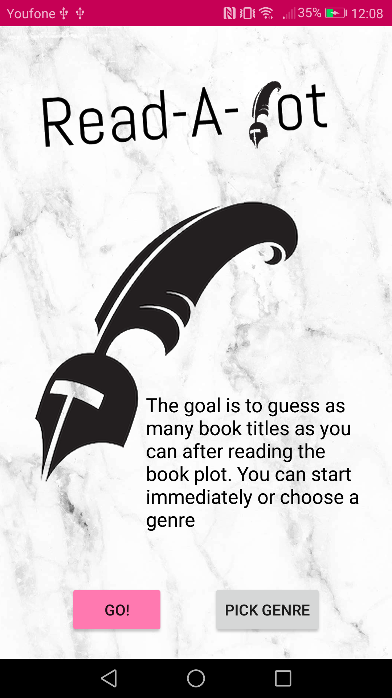
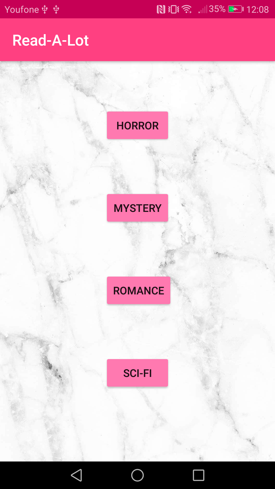
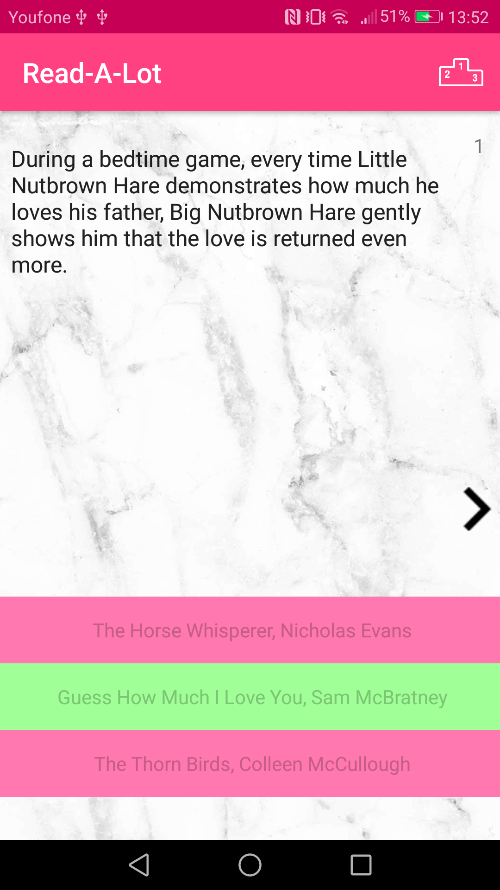

Let's guess the book title!  
Are you bored and would like to test your knowledge about books. Than this is the perfect app for you! The app will show you a book plot and it's your job to choose the right title. Start immediately or choose a genre. Enjoy!

Julia Anten 
Programmeerproject 
Minor Programmeren UvA

## Screenshots

 

 
Start screen, genre choose screen & game screen

For the proposal see PROPOSAL.md

Logo from [rbmm](http://rbmm.com/work/galahad-books-logo/) 
 Copyright © 2017 Julia Anten. All rights reserved.
 
 This work is licensed under a <a rel="license" href="http://creativecommons.org/licenses/by-nc-sa/4.0/">Creative Commons Attribution-NonCommercial-ShareAlike 4.0 International License</a>.
