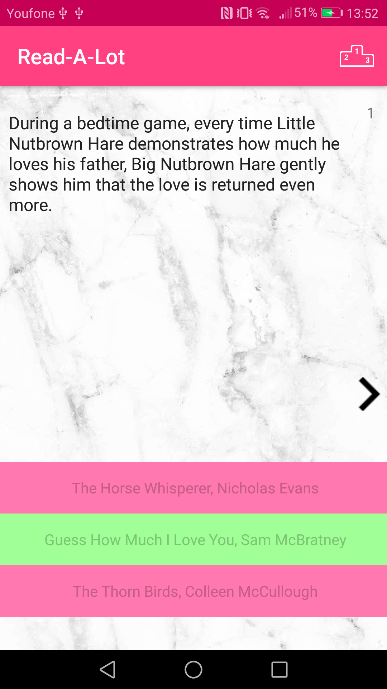

# Report

In this game you are supposed to guess the book title after reading the book plot. You can start immediately with the best sold books of all times, or you can choose a genre (horror, mystery, sci-fi or romance). See how far you can get by improving your streak.

Text continues after images

GameActivity

## Technical Design 
The app exists of three activities, an AsyncTask and a HTTPRequestHelper.  
#### BookAsyncTask
The AsyncTask sends a request to the HttpRequestHelper and returns the book info to the game activity.
#### HttpRequestHelper
The HttpRequestHelper sends the request to the google books [API](https://developers.google.com/books/) and returns a string with all the corresponding book volumes.
#### StartActivity: 
This activity informs users how the game is played and lets the user choose between starting immediately or choosing a genre.
#### GenreActivity:
This activity exists of four buttons with the four different genres. After a genre is chosen, it sends the user to the game activity with the genre that the user chose through an intent.
#### GameActivity:
This activity lets you play the game and contains most of the code. The functions are divided in six categories: initiate, book info, answers, next, shared preferences and menu.   
Initiate: Initiate functions are mostly used onCreate.  

- 	checkConnection checks if there is internet connection during onCreate and when a new question is created.
-  setUpViews sets up all the views and buttons used in this activity.
-  selectList gets the genre from the intent and then selects list with books corresponding to the genre the user selected. 

Book info: Handles the book info that the users gets back from the API.

- bookSearch sends a request for a book to the AsyncTask. If the API sends a wrong responseCode three times, a message is shown to try again later.
- handleBookInfo starts with handeling the info from the API. Calls checkInfo, getBookPlot and filterBookPlot.
- checkInfo checks is the responseCode from the API is correct. 
- getBookPlot first gets all the different books the API sends back and then select the right one. If there is no book plot or the right book can't be found, it calls bookSearch.
- filterBookPlot removes the name of the author and the name of the book from the book plot. Calls setupNext.
- setupNext calls setToViews during onCreate and normally shows the next button when the next question is pre-rendered, it will be disabled till an answer is chosen.

Answers: Handles when an answer is chosen.

- onAnswerClicked checks which answer button is clicked and calls checkAnswers and changeButtons.
- checkAnswers checks if the user has chosen the right answer and adds this to the users streak if it is correct. If the answer is in correct checkHighScores is called and the streak is put back to zero. 
- checkHighScores checks if the current streak is higher than any of the current high scores and saves this to shared preferences.
- changeButtons changes the background color of the right button, disables the answer buttons and enables the next button.

Next: Handles the next question.

- onNextClicked calls setToViews and checkConnection (see initiate) after the next button is clicked.
- setToViews sets plot and answers to their views. Calls restoreBeginSettings, assertWrong and nextSearch.
- restoreBeginSettings changes all the buttons and views back to their initial states.
- assertWrong assert wrong titles to their variable and makes sure their are not the same as the right answer.
- nextSearch starts bookSearch again to pre-render and make sure that users don't have to wait on the app. 

Shared preferences: In this categories are functions who save and load the streak and high scores from and to the shared preferences.

Menu: These functions handle the high score button in the action bar.

## Changes and challenges during process

#### Changed request to the API
One of the biggest changes I made was how I requested book plots from the API. First, I was planning to request random books from the API and use them for the game. It only turned out none of the API I read about was able to do this. They all needed some sort of search key. So I decided to add a list of books to the app and request books from that list to the API. One limitation is that there are now less books in the game, which means that people can actually tire of it, since they know all the books. Preferable I would have chosen another solution, but given the time I had I feel like this is the option possible. It would be very nice if the list with books was way bigger.

#### Added genres
After the app worked completely I added more lists with books in different genres, I added [horror](https://www.librarything.com/bookaward/Horror%3A+The+100+Best+Books), [mystery](https://www.librarything.com/bookaward/H.R.F.+Keating%27s+100+Best+Crime+%2526+Mystery+Books), [romance](https://www.goodreads.com/list/show/84922.Top_100_Romance_Novels_on_Goodreads) and [sci-fi](https://www.librarything.com/bookaward/David+Pringle%27s+Best+100+Science+Fiction+Novels). It turned out to be pretty easy to add these genres, since it was just added different lists of books to the app. It gives users something extra when they tire of the initial game or don't know the books there. 

